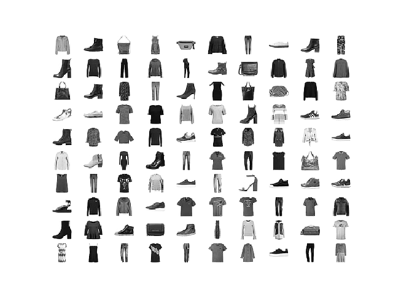
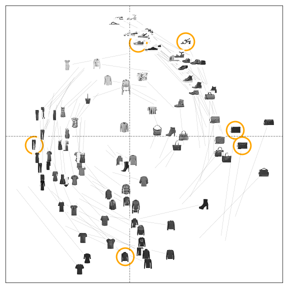
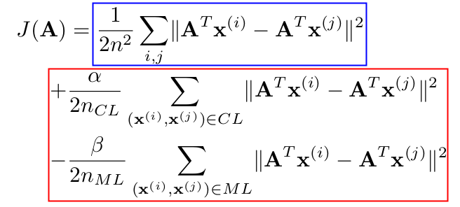

class: middle, center, title-slide
count: true

# User-steering Interpretable Visualization with   Probabilistic PCA

 

Viet Minh Vu and Benoı̂t Frénay

NADI Institute - PReCISE Research Center

University of Namur, Belgium

25/04/2019

???
Introducing our work on integrating the user's feedbacks on the visualization into a probabilistic DR method.

---

## Visualization of high dimensional data:
## Dimensionality Reduction (DR) problem

.center.width-80[]
.caption[Samples from the Fashion-MNIST dataset]

.footnote[https://github.com/zalandoresearch/fashion-mnist]

---
count: true
## Probabilistic Principle Component Analysis (PPCA)

.center.width-70[]
.caption[Having an initial visualization with PPCA model ...]

---
count: true
## Proposed Interactive PPCA (iPPCA)

.center.width-70[]
.caption[The user wants to manipulate the visualization by moving some points]

---
count: true
## iPPCA result

.center.width-70[]
.caption[The result of the interactive model is explainable to the users]

---
# Motivation

*User interaction in model design and analysis*

---
count: true

# Motivation

*User interaction in model design and analysis*

+ Visual analytic with Human-in-the-loop

.center.width-100[]

.footnote[Sacha, Dominik, et al. "Knowledge generation model for visual analytics." IEEE TVCG 2014]

---
count: true

# Motivation

*User interaction in model design and analysis*
+ Probabilistic model pipeline

.center.width-80[]

.footnote[David Blei, et al. "Variational Inference: Foundations and Modern Methods." NIPS 2016 Tutorial]

---
count: true

# Motivation

*User interaction in model design and analysis*
+ Probabilistic model pipeline with revising

.center.width-80[]

.footnote[David Blei, et al. "Variational Inference: Foundations and Modern Methods". NIPS 2016 Tutorial]

---
count: true

# Motivation

*User interaction in model design and analysis*
+ Visual analytic with Human-in-the-loop
+ Probabilistic model pipeline with revising

---
# Existing approaches

*Intergrating **user's feedbacks** into existing DR methods*

Some (complicated) examples.

---
count: true

# Existing approaches

*Intergrating **user's feedbacks** into existing DR methods*

.grid[
.kol-1-2[
.center.width-100[]
]
.kol-1-2[
]
]

---
count: true
# Existing approaches

*Intergrating **user's feedbacks** into existing DR methods*

.grid[
.kol-1-2[
.center.width-100[]
.center.width-100[]
]
.kol-1-2[
]
]

---
count: true
# Existing approaches

*Intergrating **user's feedbacks** into existing DR methods*

.grid[
.kol-1-2[
.center.width-100[]
.center.width-100[]
]
.kol-1-2[
.center.width-100[]
]
]

???
+ weighted MDS
+ Constrained Locality Preserving Projections (LPP)
+ Semi-supervised PCA (A is weights matrix)

---
count: true
# Existing approaches

*Intergrating **user's feedbacks** into existing DR methods*

.grid[
.kol-1-2[
.center.width-100[]
.center.width-100[]
]
.kol-1-2[
.center.width-100[]
]
]

+ User's feedbacks $\Longrightarrow$ **Regularization term**
+ Jointly optimized with the Objective function of the basic DR method.

???

+ others':
    - constraints = regularization term
    - many constraint types, many optim -> many reg. term 

+ ours':
    - constraint in prob. model
    - test with PPCA
    - see later, can extend it, without changing the optim

+ repeat:
    - with this approach, what we can obtain (model-based ML advantages)

---
count: true

# Existing approaches

Intergrating **user's feedbacks** into existing DR methods as a **regularization term**

---
count: true

# Existing approaches and ours

Intergrating **user's feedbacks** into $\underbrace{\footnotesize{ \text{existing DR methods} }}_{\Downarrow}$ ~~as a **regularization term**~~

.center[$\text{ \small{a probabilistic dimensionality reduction model} }$]

---
count: true

# Existing approaches and ours

Intergrating **user's feedbacks** into $\underbrace{\footnotesize{ \text{existing DR methods} }}_{\Downarrow}$ ~~as a **regularization term**~~

.center[$\text{ \small{a probabilistic dimensionality reduction model} }$]

+ Probabilistic PCA (PPCA) as a simple basic model to work with

+ **User's feedbacks** $\Large \approx$ prior knowledge to (re)construct the model.

.center.width-80[]

---

count: true

.center.width-80[]

The user-indicated postion of selected points is modelled directly

in the prior distribution of the PPCA model.

---
# A closer look at the PPCA model

## A generative view of the probabilistic PCA model.
+ 2-dimensional data $\color{green}{p(\mathbf{x})}$
+ generated from 1-dimensional latent variable $\color{purple}{p(\mathbf{z})}$

.center.width-100[]

.footnote[Bishop's PRML Figure. 12.9]

---
# Proposed interactive PPCA model

+ $\mathbf{X} = \\{ \mathbf{x}_n \\}$: observed dataset of N data points of D-dimensions.
+ The embedded points in the 2D visualization imply the corresponding latent variables $\mathbf{Z} = \\{ \mathbf{z}_n \\}$.
+ The moved points in the visualization are modelled in the prior distribution of $\mathbf{Z}$
.center.width-70[]
+ The iPPCA model:
$
    \mathbf{x}\_n \mid \mathbf{z}\_n \sim \mathcal{N}(\mathbf{x}\_n \mid \mathbf{W}\mathbf{z}\_n, \; \sigma^{2}\mathbf{I}\_{\_{D}}).
$
+ The inference problem:
$
\mathbf{\theta}\_{\_{MAP}} = \text{argmax}\_{\mathbf{\theta}} \log p(\mathbf{\theta} \mid \mathbf{X})
$
where $\mathbf{\theta}$ represents all model's parameters.
+ The MAP estimate of the latent variables $\mathbf{Z}$ is found by following the partial gradient $\nabla_{\mathbf{Z}} \log p(\mathbf{\theta}, \mathbf{X})$ to its local optima.

---
# How the user prior is handled?
+ The user can fix the position of several interested points, with some **level of uncertainty** ($\sigma_{fix}$)
+ A very small **uncertainty** $\Longrightarrow$ the user is very certain.
+ A large **uncertainty** $\Longrightarrow$ the user is not sure.

.grid[
.kol-1-3[
.center.width-100[]
.caption[user's uncertainty $\sigma_{fix}$]
]
.kol-1-3[
.center.width-100[]
.caption[Very small $\sigma_{fix} = 1e-4$: very sure]
]
.kol-1-3[
.center.width-90[]
.caption[Large $\sigma_{fix} = 0.2$: very uncertain]
]
]

---
# Some working examples

.center.width-100[]
.caption[90 images of Quickdraw dataset]

---
count: true
# Some working examples

.center.width-100[]
.caption[100 images of Fashion dataset]

---
count: true
# Some working examples

.center.width-100[]
.caption[203 datapoints in Automobile dataset]

---
# More discussion on the motivation of this approach

+ Problem of PPCA's **ambiguous-rotation**:

---
count: true
# More discussion on the motivation of this approach

+ Problem of PPCA's **ambiguous-rotation**:
.center.width-50[]
.caption[*The* wife in my eyes]

---
count: true
# More discussion on the motivation of this approach

+ Problem of PPCA's **ambiguous-rotation**:
.center.width-50[]
.caption[*The* wife in others' eyes]

---
count: true
# More discussion on the motivation of this approach

*Problem of PPCA's **ambiguous-rotation**:*
+ The principle components in PPCA are not necessarily orthogonal
+ The visualization can thus be in any rotation around the origin

*Role of user interaction:*
+ Can be considered as a complement to solve the above ambiguity
+ The user's decision is subjective, but can help to communicate the analytical result
+ Creating a more understandable, easily explainable visualization

---
# Advantage of probabilistic approach

*Combination of solid theoretical models and modern powerful inference toolboxes*
+ Take any old-class model or modern generative model
+ Plug into a modern probability framework (Stan, PyMC3, Pyro, Tensorflow Probability)

*Can easily extend the classic models*
+ extend the general generative process:
$$
\mathbf{x}_n \mid \mathbf{z}_n \sim \mathcal{N}(f(\mathbf{z}_n), \sigma^{2} \mathbf{I})
$$
    - in PPCA model, $f(\mathbf{z}_n) = \mathbf{W} \mathbf{z}_n$
    - but $f(\mathbf{z}_n)$ can be any high-capacity representation function (a neural net)
+ take advantages of the modern inference methods, e.g., *Stochastic Variational Inference*

---
count: true
# Advantage of probabilistic approach

.center.width-50[]
.caption[Embedding of 1797 digits with modified PPCA in which a decoder $f(\mathbf{z})$ is a simple neural network with one hidden layer of 50 units and a sigmoid activation function. The inference is done with pyro's built-in SVI optimizer.]

---
# Recap

+ **[Why we do that]** The proposed interactive PPCA model allows the user to control the visualization
    - in order to create an explainable one (for *communicating the analytical result*)
    - explore the visualization (kind of *"what-if" analysis*)

+ **[Technique]** The user's feedbacks can be efficiently integrated into a probabilistic model via the prior distribution of the latent variable.

+ **[Potential]** The probabilistic model is flexible to extend and can be easily optimized by the blackbox inference methods.

+ **[Future work]** We can thus focus on the problem of *modeling the user's feedback* without worrying about the complex optimization procedure.

---
class: middle, center, 
count: true

background-image: url(figures/esann2019/bg.png)
background-opacity: 0.1

# User-steering Interpretable Visualization with   Probabilistic PCA

 

Viet Minh Vu and Benoı̂t Frénay

NADI Institute - PReCISE Research Center

University of Namur, Belgium

-