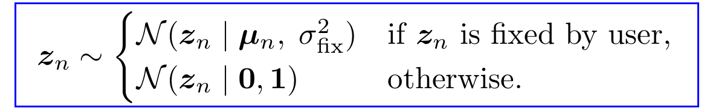
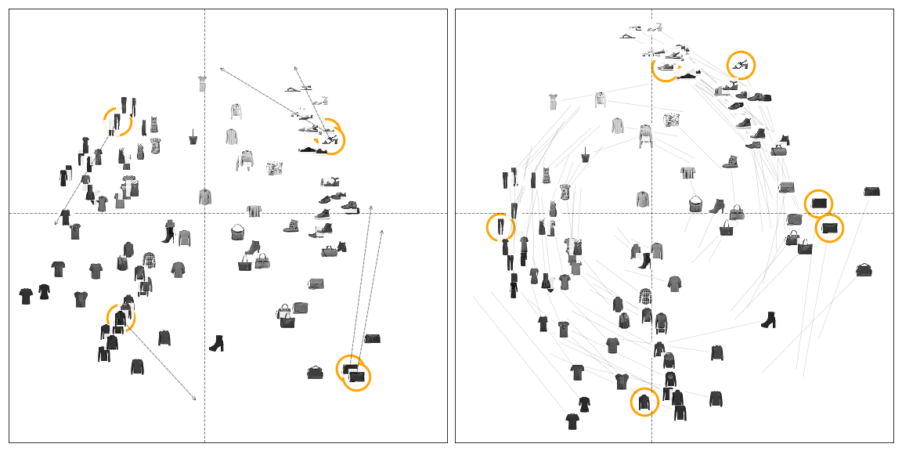

class: middle, center, title-slide
count: true

# User-steering Interpretable Visualization with   Probabilistic PCA

 

Viet Minh Vu and Benoı̂t Frénay

NADI Institute - PReCISE Research Center

University of Namur, Belgium

25/04/2019

???
Introducing our work on integrating the user's feedbacks on the visualization into a probabilistic DR method.

---

## Problem: Dimensionality Reduction (DR)

.center.width-80[]
.caption[Samples from the Fashion-MNIST dataset]

---

## Visualization of high dimensional data

.center.width-60[]
Having an initial visualization with the Probabilistic Principle Component Analysis (PPCA) model ...

---

## Proposed interactive PPCA model (iPPCA)

.center.width-60[]
The user can manipulate the visualization by moving some points.

---

## iPPCA result

.center.width-60[]
The result of the interactive model is explainable to the users.

---

# Motivation
*User interaction in model design and analysis*

.center.width-100[]
.caption[Visual analytic method with Human-in-the-loop $^{[1]}$]

+ The user can interact directly with the visualization to give their feedbacks.
+ The model can update itself to take into account these feedbacks and produce a new visualization.

.footnote[[1]Sacha, Dominik, et al. "Knowledge generation model for visual analytics." IEEE TVCG 2014]

---
class: smaller
# Existing approaches

*Integrating user's feedbacks into existing Dimensionality Reduction (DR) methods*

+ Weighted MDS with the some fixed points to modify the weights $\omega\_{F}$:
.larger[
$$
\mathbf{Y} = \text{argmin}\_{\mathbf{Y}}
\sum\_{i < j \leq n} \rho 	 \Big| d\_{\omega}(i,j) - d\_{Y}(i,j) \Big| + (1-\rho) \Big | d\_{\omega\_{F}}(i,j) - d\_{Y}(i,j) \Big |
$$
]

+ Semi-supervised PCA with sets of Must-links (ML) and Cannot-links (CL):
$$
J(\mathbf{W}) = \frac{1}{2 n^2} \sum\_{i,j} { | \mathbf{x}\_{i} - \mathbf{y}\_{j} | }^2 + \frac{\alpha}{2 n\_{CL}} \sum\_{CL} { | \mathbf{x}\_{i} - \mathbf{y}\_{j} | }^2 - \frac{\beta}{2 n\_{ML}} \sum\_{ML}{ | \mathbf{x}\_{i} - \mathbf{y}\_{j} | }^2
$$

+ Constrained Locality Preserving Projections with ML and CL:
$$
\mathbf{W}  = \text{argmin}\_{\mathbf{W}} \frac{1}{2} \Big( \sum\_{i,j}(\mathbf{y}\_{i} - \mathbf{y}\_{j})^2 \widetilde{M}\_{ij} + \sum\_{ML'}(\mathbf{y}\_{i} - \mathbf{y}\_{j})^2  - \sum\_{CL'}(\mathbf{y}\_{i} - \mathbf{y}\_{j})^2 
\Big)
$$

    - $\mathbf{y}\_{j} = \mathbf{W}^T {\mathbf{x}}\_{j}$, $\mathbf{W}$ is projection matrix, $\mathbf{M}$ is weights matrix
    - ML', CL' are the extended set of Must-links and Cannot-links constraints

---
count: false
class: smaller
# Existing approaches

*Integrating user's feedbacks into existing Dimensionality Reduction (DR) methods*

+ Weighted MDS with the some fixed points to modify the weights $\omega\_{F}$:
.larger[
$$
\mathbf{Y} = \text{argmin}\_{\mathbf{Y}}
\color{blue}{\sum\_{i < j \leq n} \rho 	 \Big| d\_{\omega}(i,j) - d\_{Y}(i,j) \Big|} + \color{red}{(1-\rho) \Big | d\_{\omega\_{F}}(i,j) - d\_{Y}(i,j) \Big |}
$$
]

+ Semi-supervised PCA with sets of Must-links (ML) and Cannot-links (CL):
$$
J(\mathbf{W}) = \color{blue}{\frac{1}{2 n^2} \sum\_{i,j} { | \mathbf{x}\_{i} - \mathbf{y}\_{j} | }^2} + \color{red}{\frac{\alpha}{2 n\_{CL}} \sum\_{CL} { | \mathbf{x}\_{i} - \mathbf{y}\_{j} | }^2 - \frac{\beta}{2 n\_{ML}} \sum\_{ML}{ | \mathbf{x}\_{i} - \mathbf{y}\_{j} | }^2}
$$

+ Constrained Locality Preserving Projections with ML and CL:
$$
\mathbf{W}  = \text{argmin}\_{\mathbf{W}} \frac{1}{2} \Big( \color{blue}{\sum\_{i,j}(\mathbf{y}\_{i} - \mathbf{y}\_{j})^2 \widetilde{M}\_{ij}} + \color{red}{\sum\_{ML'}(\mathbf{y}\_{i} - \mathbf{y}\_{j})^2  - \sum\_{CL'}(\mathbf{y}\_{i} - \mathbf{y}\_{j})^2}
\Big)
$$

    - $\mathbf{y}\_{j} = \mathbf{W}^T {\mathbf{x}}\_{j}$, $\mathbf{W}$ is projection matrix, $\mathbf{M}$ is weights matrix
    - ML', CL' are the extended set of Must-links and Cannot-links constraints

---
count: false
# Existing approaches

*Integrating **user's feedbacks** into existing DR methods*

+ User's feedbacks $\Longrightarrow$ **Explicit regularization term**
+ Jointly optimized with the objective function of the basic DR methods.

*Problems?*
+ Many discrete methods
+ Manually design the regularization term explicitly

*$\Longrightarrow$ Can we find another approach?*

---

# Probabilistic approach

.center.width-100[]

.footnote[David Blei, et al. "Variational Inference: Foundations and Modern Methods". NIPS 2016 Tutorial]

---

# Probabilistic PCA
+ *Probabilistic reformulation as the basic for a Bayesian treatment of PCA $^{[1]}$*

+ Illustration for the generative process in PPCA model $^{[2]}$
    - generate 2-dimensional data $\color{green}{p(\mathbf{x})}$  from 1-dimensional latent variable $\color{purple}{p({z})}$

.center.width-90[]

.footnote[[1] Bishop, Christopher M. "Bayesian pca." Advances in neural information processing systems. 1999. [2] Bishop's PRML book, Figure 12.9]

---

# Probabilistic PCA

+ $\mathbf{X} = \\{ \mathbf{x}_n \\}$: N observations of D-dimensions.
+ The embedded points in the 2D visualization are the latent variables $\mathbf{Z} = \\{ \mathbf{z}_n \\}$.
+ Likelihood
$\mathbf{x}\_n \mid \mathbf{z}\_n \sim \mathcal{N}(\mathbf{x}\_n \mid \mathbf{W}\mathbf{z}\_n, \; \sigma^{2}\mathbf{I}\_{\_{D}})$
+ The inference problem:
${\theta}\_{\_{MAP}} = \text{argmax}\_{\bf{\theta}} \log p(\mathbf{\theta} \mid \mathbf{X})$
where $\mathbf{\theta}$ represents all the model's parameters (including $\mathbf{Z}$).
+ The MAP estimate of the latent variables $\mathbf{Z}$ is found by following the partial gradient $\nabla_{\mathbf{Z}} \log p(\mathbf{\theta}, \mathbf{X})$ to its local optima.

---

# Proposed Interactive PPCA model

+ iPPCA: The user-indicated position of the selected points is modelled directly
in the prior distribution of the PPCA model.

.center.width-80[]
.center.width-80[]

---
# How user's constraints are handled?
+ The user can fix the position of several interested points, with some **level of uncertainty** ($\sigma^2_{fix}$)
+ A very small variance $\Longrightarrow$ the user is very certain.
+ A large variance $\Longrightarrow$ the user is not sure.

.grid[
.kol-1-3[
.center.width-100[]
.caption[user's uncertainty $\sigma^2_{fix}$]
]
.kol-1-3[
.center.width-100[]
.caption[$\sigma^2_{fix} = 1e-4$:  very sure]
]
.kol-1-3[
.center.width-90[]
.caption[$\sigma^2_{fix} = 0.2$:  very uncertain]
]
]

---

# Evaluation of the iPPCA model
*The workflow:*
+ Show the initial visualization of the (original) PPCA model
+ The user selects and moves some anchor points
+ Reconstruct the iPPCA model to create a new visualization.
    - The uncertainty of the feedbacks ($\sigma^2_{fix}$) is small
    - Hyper parameters of the optimization process are chosen to be the best

*How to evaluate:*
+ Show how to explain the new visualization
    - The level on which we can understand / explain the visualization is considered as a qualitative measure

---

## Quickdraw dataset

.center.width-100[]
.caption[90 sample images from Quickdraw dataset]

+ Move 6 different points of different groups
+ The global structure of the embedding is preserved

---
## Fashion dataset

.center.width-90[]
.caption[100 sample images from Fashion dataset]

+ Moves 6 points towards the coordinate axes
+ The goal of this interaction is to re-define the axes in the visualization

---
## Fashion dataset

.grid[
.kol-1-2[.width-100[]]
.kol-1-2[.width-100[]
]]

*How to explain the new axes?*
+ Horizontal axis represents **shape**
+ Vertical axis represents **color density**

---
## Automobile dataset
.center.width-80[]
.caption[203 data points of the Automobile dataset]
.grid[
.kol-1-2[
*How to explain the new axes?*
+ Horizontal axis: cars' **size**
+ Vertical axis: cars' **power**
]
.kol-1-2[
.width-70[]
]
]

---
# Advantage of probabilistic approach

*Combination of solid theoretical models and modern powerful inference toolboxes*
+ Take any old-class model or modern generative model
+ Plug into a probability framework $^{[1]}$  which support modern inference methods like *Stochastic Variational Inference (SVI)*

*Can easily extend the generative process*
$$
\mathbf{x}_n \mid \mathbf{z}_n \sim \mathcal{N}(f(\mathbf{z}_n), \sigma^{2} \mathbf{I})
$$
+ in PPCA model, $f(\mathbf{z}_n) = \mathbf{W} \mathbf{z}_n$
+ $f(\mathbf{z}_n)$ can be any high-capacity representation function  (a neural net)

.footnote[[1] Stan, PyMC3, Pyro, TensorFlow Probability]

---

.grid[
.kol-1-2[.width-100[]]
.kol-1-2[.width-100[]]
]
.caption[Embedding of DIGITS dataset with the original PCA and the modified PPCA model]

+ The decoder $f(\mathbf{z})$ of PPCA is a simple neural network with one hidden layer of 50 units and a sigmoid activation function.
+ The inference is done by the Pyro's built-in SVI optimizer $^{[1]}$.

.footnote[[1] Pyro, Deep Universal Probabilistic Programming, http://pyro.ai/]

---
# Recap

Propose the interactive PPCA model allowing the user to control the visualization

+ **[Why]** To communicate the analytical result (e.g., create an explainable visualization) and to explore the visualizations (*"what-if" analysis*)

+ **[How]** The user's feedbacks can be efficiently integrated into a probabilistic model via prior distributions of latent variables.

+ **[Potential]** The probabilistic model is flexible to extend and can be easily optimized by the black-box inference methods.

+ **[Future work]** Focus on the *user's feedback modeling* problem without worrying about the complex optimization procedure.

---
class: middle, center, 
count: false

background-image: url(figures/esann2019/bg.png)
background-opacity: 0.1

# User-steering Interpretable Visualization with   Probabilistic PCA

 

Viet Minh Vu and Benoı̂t Frénay

NADI Institute - PReCISE Research Center

University of Namur, Belgium

-