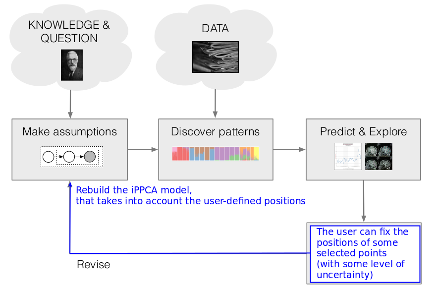

class: middle, center, title-slide
count: true

# User-steering Interpretable Visualization with   Probabilistic PCA

 

Viet Minh Vu and Benoı̂t Frénay

NADI Institute - PReCISE Research Center

University of Namur, Belgium

25/04/2019

???
Introducing our work on integrating the user's feedbacks on the visualization into a probabilistic DR method.

---

## Problem: Dimensionality Reduction (DR)

.center.width-80[]
.caption[Samples from the Fashion-MNIST dataset]

.footnote[https://github.com/zalandoresearch/fashion-mnist]

---

## Visualization of high dimensional data

.center.width-60[]
Having an initial visualization with the Probabilistic Principle Component Analysis (PPCA) model ...

---

## Proposed Method: Interactive PPCA (iPPCA)

.center.width-60[]
The user wants to manipulate the visualization by moving some points.

---

## iPPCA Result

.center.width-60[]
The result of the interactive model is explainable to the users.

---

# Motivation

*User interaction in model design and analysis*

.center.width-100[]
.caption[Visual analytic with Human-in-the-loop]

+ The user can interact directly with the visualization to give their feedbacks.
+ The model can update itself to take into account these feedbacks and produce a new visualization.

.footnote[Sacha, Dominik, et al. "Knowledge generation model for visual analytics." IEEE TVCG 2014]

---
count: true
# Existing approaches

*Integrating **user's feedbacks** into existing DR methods*

|Constrained DR methods| Constrained objective functions|
|---|---|
|Weighted MDS| .width-60[] |
|Semi-supervised PCA|  .width-60[] |
|Constrained Locality Preserving Projections|  .width-60[] |

+ User's feedbacks $\Longrightarrow$ **Regularization term**
+ Jointly optimized with the Objective function of the basic DR method.
---

+ Weighted MDS:
.larger[
$$
\mathbf{Y} = \text{argmin}\_{\mathbf{Y}}
\sum\_{i < j \leq n} \rho 	 \Big| d\_{\omega}(i,j) - d\_{Y}(i,j) \Big| + (1-\rho) \Big | d\_{\omega\_{F}}(i,j) - d\_{Y}(i,j) \Big |
$$
]

+ Semi-supervised PCA with ensemble of **Must-links (ML)** and **Cannot-links (CL)**:
$$
J(\mathbf{W}) = \frac{1}{2 n^2} \sum\_{i,j} { | \mathbf{x}\_{i} - \mathbf{y}\_{j} | }^2 + \frac{\alpha}{2 n\_{CL}} \sum\_{CL} { | \mathbf{x}\_{i} - \mathbf{y}\_{j} | }^2 - \frac{\beta}{2 n\_{ML}} \sum\_{ML}{ | \mathbf{x}\_{i} - \mathbf{y}\_{j} | }^2
$$

+ Constrained Locality Preserving Projections with **ML** and **CL**:
$$
\mathbf{W}  = \text{argmin}\_{\mathbf{W}} \frac{1}{2} \Big( \sum\_{i,j}(\mathbf{y}\_{i} - \mathbf{y}\_{j})^2 \widetilde{M}\_{ij} + \sum\_{ML'}(\mathbf{y}\_{i} - \mathbf{y}\_{j})^2  - \sum\_{CL'}(\mathbf{y}\_{i} - \mathbf{y}\_{j})^2 
\Big)
$$

    - $\mathbf{y}\_{j} = \mathbf{W}^T {\mathbf{x}}\_{j}$
    - $\mathbf{W}$ is projection matrix, $\mathbf{M}$ is weights matrix
    - ML, CL are ensemble of Must-links and Cannot-links
    - ML', CL' are the extended set of constraints

---
count: true

# Motivation

*User interaction in model design and analysis*
+ Probabilistic model pipeline

.center.width-80[]

.footnote[David Blei, et al. "Variational Inference: Foundations and Modern Methods." NIPS 2016 Tutorial]

---
count: true

# Motivation

*User interaction in model design and analysis*
+ Probabilistic model pipeline with revising

.center.width-80[]

.footnote[David Blei, et al. "Variational Inference: Foundations and Modern Methods". NIPS 2016 Tutorial]

---
count: true

# Motivation

*User interaction in model design and analysis*
+ Visual analytic with Human-in-the-loop
+ Probabilistic model pipeline with revising

---
count: true
# Existing approaches

*Integrating **user's feedbacks** into existing DR methods*

.grid[
.kol-1-2[
.center.width-100[]
.center.width-100[]
]
.kol-1-2[
.center.width-100[]
]
]

+ User's feedbacks $\Longrightarrow$ **Regularization term**
+ Jointly optimized with the Objective function of the basic DR method.

???

+ others':
    - constraints = regularization term
    - many constraint types, many optim -> many reg. term 

+ ours':
    - constraint in prob. model
    - test with PPCA
    - see later, can extend it, without changing the optim

+ repeat:
    - with this approach, what we can obtain (model-based ML advantages)

---
count: true

# Existing approaches

Integrating **user's feedbacks** into existing DR methods as a **regularization term**

---
count: true

# Existing approaches and ours

Integrating **user's feedbacks** into $\underbrace{\footnotesize{ \text{existing DR methods} }}_{\Downarrow}$ ~~as a **regularization term**~~

.center[$\text{ \small{a probabilistic dimensionality reduction model} }$]

---
count: true

# Existing approaches and ours

Integrating **user's feedbacks** into $\underbrace{\footnotesize{ \text{existing DR methods} }}_{\Downarrow}$ ~~as a **regularization term**~~

.center[$\text{ \small{a probabilistic dimensionality reduction model} }$]

+ Probabilistic PCA (PPCA) as a simple basic model to work with

+ **User's feedbacks** $\Large \approx$ prior knowledge to (re)construct the model.

.center.width-80[]

---

count: true

.center.width-80[]

The user-indicated position of selected points is modelled directly

in the prior distribution of the PPCA model.

---
# A closer look at the PPCA model

## A generative view of the probabilistic PCA model.
+ 2-dimensional data $\color{green}{p(\mathbf{x})}$
+ generated from 1-dimensional latent variable $\color{purple}{p(\mathbf{z})}$

.center.width-100[]

.footnote[Bishop's PRML Figure. 12.9]

---
# Proposed interactive PPCA model

+ $\mathbf{X} = \\{ \mathbf{x}_n \\}$: observed dataset of N data points of D-dimensions.
+ The embedded points in the 2D visualization imply the corresponding latent variables $\mathbf{Z} = \\{ \mathbf{z}_n \\}$.
+ The moved points in the visualization are modelled in the prior distribution of $\mathbf{Z}$
.center.width-70[]
+ The iPPCA model:
$
    \mathbf{x}\_n \mid \mathbf{z}\_n \sim \mathcal{N}(\mathbf{x}\_n \mid \mathbf{W}\mathbf{z}\_n, \; \sigma^{2}\mathbf{I}\_{\_{D}}).
$
+ The inference problem:
$
\mathbf{\theta}\_{\_{MAP}} = \text{argmax}\_{\mathbf{\theta}} \log p(\mathbf{\theta} \mid \mathbf{X})
$
where $\mathbf{\theta}$ represents all model's parameters.
+ The MAP estimate of the latent variables $\mathbf{Z}$ is found by following the partial gradient $\nabla_{\mathbf{Z}} \log p(\mathbf{\theta}, \mathbf{X})$ to its local optima.

---
# How the user prior is handled?
+ The user can fix the position of several interested points, with some **level of uncertainty** ($\sigma_{fix}$)
+ A very small **uncertainty** $\Longrightarrow$ the user is very certain.
+ A large **uncertainty** $\Longrightarrow$ the user is not sure.

.grid[
.kol-1-3[
.center.width-100[]
.caption[user's uncertainty $\sigma_{fix}$]
]
.kol-1-3[
.center.width-100[]
.caption[Very small $\sigma_{fix} = 1e-4$: very sure]
]
.kol-1-3[
.center.width-90[]
.caption[Large $\sigma_{fix} = 0.2$: very uncertain]
]
]

---
# Evaluation of the iPPCA model
*The workflow:*
+ First, show the initial visualization of the (original) PPCA model
+ Then the user selects and moves some anchor points
+ Finally, reconstruct the iPPCA model, re-run inference to create a new visualization.
    - The uncertainty of the feedbacks ($\sigma_{fix}$) is small
    - The hyper parameters of the optimization process are chosen to be the best

*How to evaluate:*
+ We do not show the quantitative measures (e.g the quality metrics)
+ We show how to explain the new visualization instead
    - The level for which we can understand / explain the visualization is considered as a qualitative measure

---
## Quickdraw dataset

.center.width-100[]
.caption[90 sample images from Quickdraw dataset]

+ Move 6 different points of different groups
+ The global structure of the embedding is preserved

---
## Fashion dataset

.center.width-90[]
.caption[100 sample images from Fashion dataset]

+ Moves 6 points towards the coordinate axes
+ The goal of this interaction is to re-define the axes in the visualization

---
## Fashion dataset

.grid[
.kol-1-2[.width-100[]]
.kol-1-2[.width-100[]
]]

*How to explain the new axes?*
+ Horizontal axis represents **shape**
+ The vertical axis represents **color density**

---
## Automobile dataset
.center.width-80[]
.caption[203 data points of the Automobile dataset]
.grid[
.kol-2-5[
*How to explain the new axes?*
+ Horizontal axis: cars' **size**
+ Vertical axis: cars' **power**
]
.kol-3-5[
.width-60[]
]
]

---
# Advantage of the Probabilistic Approach

*Combination of solid theoretical models and modern powerful inference toolboxes*
+ Take any old-class model or modern generative model
+ Plug into a modern probability framework (Stan, PyMC3, Pyro, Tensorflow Probability)

*Can easily extend the classic models*
+ Extend the general generative process:
$$
\mathbf{x}_n \mid \mathbf{z}_n \sim \mathcal{N}(f(\mathbf{z}_n), \sigma^{2} \mathbf{I})
$$
    - in PPCA model, $f(\mathbf{z}_n) = \mathbf{W} \mathbf{z}_n$
    - but $f(\mathbf{z}_n)$ can be any high-capacity representation function (a neural net)
+ Take advantages of the modern inference methods, e.g., *Stochastic Variational Inference (SVI)*

---

.grid[
.kol-1-2[.width-100[]]
.kol-1-2[.width-100[]]
]
.caption[Embedding of 1797 digits with PCA (on the left) and with modified PPCA (on the right)]

+ The decoder $f(\mathbf{z})$ of PPCA is a simple neural network with one hidden layer of 50 units and a sigmoid activation function.
+ The inference is done by the pyro's built-in SVI optimizer.

.footnote[pyro, Deep Universal Probabilistic Programming, http://pyro.ai/]

---
# Recap

Propose the interactive PPCA model allowing the user to control the visualization

+ **[Why we do that]**  
    - for *communicating the analytical result*: e.g., create an explainable visualization
    - for exploring the visualizations (kind of *"what-if" analysis*)

+ **[Technique]** The user's feedbacks can be efficiently integrated into a probabilistic model via the prior distribution of the latent variable.

+ **[Potential]** The probabilistic model is flexible to extend and can be easily optimized by the blackbox inference methods.

+ **[Future work]** We can thus focus on the problem of *modeling the user's feedback* without worrying about the complex optimization procedure.

---
class: middle, center, 
count: true

background-image: url(figures/esann2019/bg.png)
background-opacity: 0.1

# User-steering Interpretable Visualization with   Probabilistic PCA

 

Viet Minh Vu and Benoı̂t Frénay

NADI Institute - PReCISE Research Center

University of Namur, Belgium

-