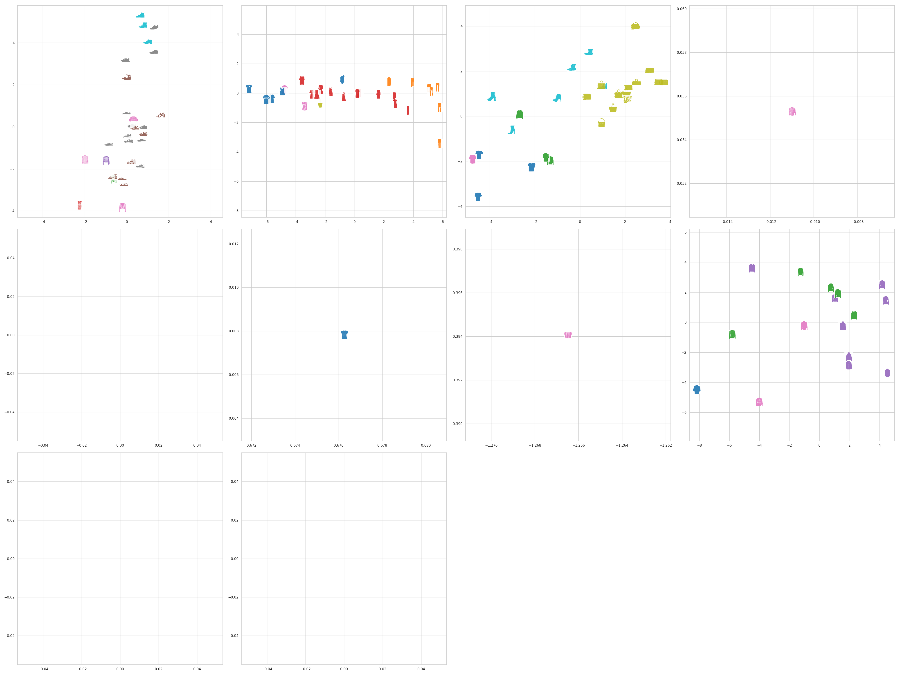

class: middle, center, title-slide
count: false

# Mixture of PPCA

  

Minh, 21/01/2019

---
exclude: true

### Summary last meeting

+ Do full Bayesian inference
    * Apply for MPPCA model
    * Redo for PPCA model (ESANN paper)

+ Make slides to explain MPPCA (~10min)
    * idea? model? priors?
    * equations (in Bishop)
    * how to implement them?
    * how to intergrate the constraints

+ Other stuffs:
    * Print paper Mixture PPCA [Tipping1999b]
    * Print lastest version of the survey

---
exclude: true

### Ref

+ AutoGuide AutoDelta: http://docs.pyro.ai/en/dev/contrib.autoguide.html#autodelta

---

# Mixture of PPCA

#### Motivation:

* Mixture model is a tool for soft-clustering, outputs the clustering assignments for each datapoint,  but we can not visualize the groups of datapoints in 2D.

* PPCA can reduce the dimensions of data,  but we still use the supervised labels to color the points in the visualization. 

* The group of points in 2D  ${\ne}$  cluster of points in high dim. (HD)

* Mixture of PPCA model can infer:
    - the 2D positions for each data point
    - and their clustering assignment
* The expected visualization with MPPCA:
    - the points of the same cluster in HD are placed close together and/or in the same group in 2D.
    - multi-views visualization: having multiple visualizations for each component   ${\to}$ discover the local structure of each component.

---

#### Input:
* Observed data: $ \mathbf{X} = \\{ \mathbf{x}_{i} \\} $, $ \quad \mathbf{x}_i  \in \mathbb{R}^{D}, \quad  i=1,..,N$

#### Output:
* Latent position in 2D: $ \mathbf{Z} =  \\{ \mathbf{z}_i \\} $, $\quad \mathbf{z}_i  \in \mathbb{R}^{M}, \quad i=1,..,N$
* Latent clustering assignment: $ \mathbf{G} = \\{ g\_{ik} \\} $, $\quad g\_{ik} \in \\{0, 1\\}, \quad k=1,..,K$  
($g\_{ik} = 1$ iif $\mathbf{x}\_{i}$ belongs to the $k^{th}$ component)

#### Evaluation:
* Visualization quality (hard to measure)
* Clustering quality (e.g. VMeasure)

---

#### Traditional mixture of Gaussians

+ A discrete indicator variable $g_{ik} \in \\{0,1\\}$ indicates whether the $k^{th}$ component generates the datapoint $\mathbf{x}_i$:

$$
p(\mathbf{x}\_{i} \mid g\_{ik}=1) = \mathcal{N}(\mathbf{x}\_{i} \mid \boldsymbol{\mu}\_k, \sigma\_k \mathbf{I}\_{\_D})
$$

where each component is an isotropic multivariate gaussian with mean $\boldsymbol{\mu}_k \in \mathbb{R}^{D}$ and scalar variance $\sigma_k$.

+ By summing all possible assignment states of each point, its marginal distribution is:
$$ p(\mathbf{x}\_{i})= \sum\_{k=1}^{K} \pi\_{k} \;\mathcal{N}(\mathbf{x}\_{i} \mid \boldsymbol{\mu}\_k, \sigma\_k \mathbf{I}\_{\_D})$$

where the mixing coefficient $\pi_k$ represents the contributon of the $k^{th}$ component.

---

#### Mixture of PPCA

For each component, replace the Gaussian distribution by a PPCA distribution: (note that the PPCA distribution is conditioned on the latent variable $\mathbf{z}\_{i}$)
$$ p(\mathbf{x}\_{i} \mid \mathbf{z}\_{i})= \sum\_{k=1}^{K} \pi\_{k} \; \underbrace{ \text{PPCA}(\mathbf{x}\_{i} \mid \mathbf{z}\_{i}, k) }_{\text{in fact, is also a Gaussian}}$$

<!-- \boldsymbol{\mu}\_k, \sigma\_k \mathbf{I}\_{\_D}) -->

#### Generative process

Each point $\mathbf{x}_i \in \mathbb{R}^{D}$ is generated from a corresponding latent variable $\mathbf{z}_i \in \mathbb{R}^{M}$ as following:

1. Choose one of $K$ components from which $\mathbf{x}_i$ will be generated.
2. Sample a latent variable $\mathbf{z}_i$ from an unit gaussian.
3. $\mathbf{x}_i$ is mapped from $\mathbf{z}_i$ via a projection matrix $\mathbf{W}_K \in \mathbb{R}^{D \times M}$, then shifted to the center $\boldsymbol{\mu}_k$ and disturbed by a variance $\sigma_k$.

    i.e., $\mathbf{x}\_{i}$ is sampled from
$\text{PPCA}(\mathbf{x}\_{i} \mid k) \equiv
 \mathcal{N}(\boldsymbol{\mu}\_{k} + \mathbf{z}\_{i} \mathbf{W}\_{k}^{T}, \sigma\_{k} \mathbf{I}\_{_{D}})$

---

# Elements of MPPCA model (1)

#### Parameters and their priors

+ Global parameter:
$\boldsymbol{\pi} = [\pi_1, \dots, \pi_K ]$

$$\boldsymbol{\pi} \sim \text{Dirichlet}(\alpha_0), \qquad \alpha_0 = \overbrace{ \big[\textstyle\frac{1}{K}, \dots, \textstyle\frac{1}{K} \big] }^{K \text{elements}}$$

+ Local parameters for each components:

$$\boldsymbol{\mu}\_{k} \sim \mathcal{N}(\mathbf{0}\_{\_{D}}, \mathbf{I}\_{\_{D}})$$

$$\sigma_k \sim \text{LogNormal}(\sigma_k \mid 0, 1)$$

$$\mathbf{W}\_{k}^{(j)} \sim \mathcal{N}(\mathbf{W}\_{k}^{(j)} \mid \mathbf{0}\_{\_{M}}, \mathbf{I}\_{\_{M}})$$

where $\mathbf{W}\_{k}^{(j)}$ is a row of the projection matrix
$\mathbf{W}\_{k} = 
\begin{bmatrix}
\mathbf{W}\_{k}^{(1)} \\\\ 
\vdots \\\\
\mathbf{W}\_{k}^{(D)} 
\end{bmatrix}
$

---

# Elements of MPPCA model (2)

#### Latent variables and their priors

Latent variables for each datapoint:

+ Latent position in low dimensional space:

$$
\mathbf{z}\_{i} \sim \mathcal{N}(\mathbf{z}\_{i} \mid \mathbf{0}\_{\_{D}}, \mathbf{I}\_{\_{D}})
$$

+ Latent clustering assignment:

The cluster id for each $\mathbf{x}\_{i}$ is assigned exactly one of $K$ components (categories): $\mathbf{g}\_{i} = \underbrace{[0, \dots, 1, \dots, 0]}\_{K elements}$.

Thus the clustering assignment is modeled by the discrete Categorical distribution: 
$$
\mathbf{g}_{i} \sim \text{Categorical}(\text{probs}=[\pi_1, \dots, \pi_K ])
$$

---

# Elements of MPPCA model (3)

#### Observed variables

Based on the clustering assigment of each point $\mathbf{g}_i$, we determine the component $k$ to which the datapoint $\mathbf{x}_i$ belongs:

$$
\mathbf{x}\_{i} \mid \mathbf{z}\_{i}, \mathbf{g}\_{i} \sim \text{PPCA}(\mathbf{x}\_{i} \mid \mathbf{z}\_{i}, k)
$$

Thus we have

$$
p(\mathbf{x}\_{i} \mid \mathbf{z}\_{i}, \mathbf{g}\_{i}) = \mathcal{N}(\boldsymbol{\mu}\_{k} + \mathbf{z}\_{i} \mathbf{W}\_{k}^{T}, \sigma\_{k} \mathbf{I}\_{_{D}})
$$

Marginalize out the discrete latent variable $\mathbf{g}\_{i}$:

$$
\begin{aligned}
p(\mathbf{x}\_{i} \mid \mathbf{z}\_{i}) &= \sum\_{g} p(\mathbf{x}\_{i} \mid \mathbf{z}\_{i}, \mathbf{g}\_{i}) \\\\
&= \sum\_{k=1}^{K} \pi\_{k} \mathcal{N}(\boldsymbol{\mu}\_{k} + \mathbf{z}\_{i} \mathbf{W}\_{k}^{T}, \sigma\_{k} \mathbf{I}\_{_{D}})
\end{aligned}
$$

---

# The model

#### Likelihood of each observation

$$
p(\mathbf{x}\_{i} \mid \mathbf{z}\_{i}, \boldsymbol{\mu}\_{k}, \sigma\_{k}, \mathbf{W}\_{k}) = \sum\_{k=1}^{K} \pi\_{k} \mathcal{N}(\boldsymbol{\mu}\_{k} + \mathbf{z}\_{i} \mathbf{W}\_{k}^{T}, \sigma\_{k} \mathbf{I}\_{_{D}})
$$

The local parameters are denoted ensemble as $\boldsymbol{\theta}\_{k} = \\{ \boldsymbol{\mu}\_{k}, \boldsymbol{\sigma}\_{k}, \mathbf{W}\_{k}\\}$

Thus the likelihood for each observation is

$$
p(\mathbf{x}\_{i} \mid \mathbf{z}\_{i}, \boldsymbol{\theta}\_{k})
$$

Denote ${\boldsymbol{\theta}} = \\{ \boldsymbol{\theta}\_{k} \\}\_{k=1}^{K}$.

The likelihood for all dataset is $p\_{\boldsymbol{\theta}}(\mathbf{X} \mid \mathbf{Z})$.

The prior of latent variables is $p\_{\boldsymbol{\theta}}(\mathbf{Z})$.

The posterior that we have to infer is $p\_{\boldsymbol{\theta}}( \mathbf{Z} \mid \mathbf{X})$.
<!-- But it is intractable so we can not calculated directly ${\to}$ approximate it. -->

---
exclude: true

#### Priors distribution

$$
\begin{aligned}
p\_{\boldsymbol{\theta}}(\mathbf{Z})
&\equiv p(\mathbf{Z}; \boldsymbol{\theta}) \\\\
& =  p \big(\mathbf{Z}, \\{ \boldsymbol{\mu}, \boldsymbol{\sigma}, \mathbf{W}\\}\_{k=1}^{K} \big)
\end{aligned}
$$ 

---

#### Posterior distribution

The true posterior $p\_{\boldsymbol{\theta}}(\mathbf{Z} \mid \mathbf{X})$ will be approximated by the variational distribution $q\_{\boldsymbol{\phi}}(\mathbf{Z})$.

The goal is thus to find the variational parameters ${\boldsymbol{\phi}}$ which make $q\_{\boldsymbol{\phi}}(\mathbf{Z})$ close to $p\_{\boldsymbol{\theta}}(\mathbf{Z} \mid \mathbf{X})$ as much as possible.

The log evidence can be written as
$$
\log p\_{\theta}({\bf X}) = {\rm ELBO} +
\rm{KL} \left( q\_{\phi}({\bf Z}) \lVert p_\{\theta}({\bf Z} | {\bf X}) \right)
$$

where the Evidence Lower BOund is defined as:
$$
{\rm ELBO} \equiv \mathbb{E}\_{q\_{\phi}({\bf Z})} \left [
\log p\_{\theta}({\bf X}, {\bf Z}) - \log q\_{\phi}({\bf Z})
\right]
$$

Since $\log p\_{\theta}({\bf X})$ is constant.
The goal of minimize the $\rm{KL} \left( q\_{\phi}({\bf Z}) \lVert p_\{\theta}({\bf Z} | {\bf X}) \right)$ is equivalent to maximize the ${\rm ELBO}$.

---

<!-- $q\_{\boldsymbol{\phi}}(\mathbf{Z})$ is fully factorized:

$$
q\_{\boldsymbol{\phi}}(\mathbf{Z})
$$ -->

<!-- $$
p(\mathbf{z}\_{i}, \boldsymbol{\mu}\_{k}, \sigma\_{k}, \mathbf{W}\_{k} \mid \mathbf{x}\_{i}) \propto p(\mathbf{x}\_{i} \mid \mathbf{z}\_{i}, \boldsymbol{\mu}\_{k}, \sigma\_{k}, \mathbf{W}\_{k}) p(\mathbf{z}\_{i}) p(\boldsymbol{\mu}\_{k}) p(\sigma\_{k}) p(\mathbf{W}\_{k})
$$ -->

<!-- $\boldsymbol{\mu} = [ \boldsymbol{\mu}\_{k} ], \quad
\boldsymbol{\sigma} = [ \sigma\_{k} ], \quad
\mathbf{W} = [ \mathbf{W}\_{k} ], \quad
k = 1, \dots, K
$

$\boldsymbol{\theta}\_{k} = \\{ \boldsymbol{\mu}, \boldsymbol{\sigma}, \mathbf{W}\\}$ : a set of all params and latent random variables. -->

# Implementation (1)

The pyro library supports to minimize the ${\rm ELBO}$ w.r.t the variational parameters $\phi$ (and the model parameters $\theta$).

The following gradient step is calculated automatically by an optimizer like Adam.
$$
\nabla\_{\theta,\phi} {\rm ELBO} = \nabla\_{\theta,\phi}\mathbb{E}\_{q\_{\phi}({\bf Z})} \left [
\log p\_{\theta}({\bf X}, {\bf Z}) - \log q\_{\phi}({\bf Z})
\right]
$$

We have to define:
+ the distributions over the latent variables, the params and the observed data (called `model`):

    $p(\boldsymbol{\pi})$, $p(\boldsymbol{\mu})$, $p(\boldsymbol{\sigma})$, $p(\mathbf{W})$, $p(\mathbf{Z})$, $p(\mathbf{G})$ and  $p(\mathbf{X} \mid \mathbf{Z}, \boldsymbol{\theta}) \equiv p(\mathbf{X} \mid \mathbf{Z}, \boldsymbol{\pi}, \boldsymbol{\mu}, \boldsymbol{\sigma}, \mathbf{W})$.

+ the variational distributions (called `guide`):

    $q(\boldsymbol{\pi})$, $q(\boldsymbol{\mu})$, $q(\boldsymbol{\sigma})$, $q(\mathbf{W})$, $q(\mathbf{Z})$, $q(\mathbf{G})$

---

# Implementation (2)

#### The choice of `guide`
+ MAP estimation for the parameters and fully Baysiean inference for the latent variables:

$$
\begin{aligned}
q(\boldsymbol{\pi}) &\sim Delta(\boldsymbol{\pi}) \\\\
q(\boldsymbol{\mu}) &\sim Delta(\boldsymbol{\mu}) \\\\
q(\boldsymbol{\sigma}) &\sim Delta(\boldsymbol{\sigma}) \\\\
q(\mathbf{W}) &\sim Delta(\mathbf{W}) \\\\
q(\mathbf{Z}) &\sim Normal(\mathbf{Z}) \\\\
q(\mathbf{G}) &\sim Categorical(\mathbf{G})
\end{aligned}
$$

+ Fully Bayesian inference:

    Since $\text{Delta}$ distribution is used as point-estimate for each parameter. 
    If we replace the $\text{Delta}$ distribution by $\text{Normal}$ distributions, we have fully Bayesian inference.

---

# Integrate the user constraints

+ The user constraint is in form: `a point ` $i$ ` should belong to cluster ` $k$.

+ To force the cluster assignment $\mathbf{g}_i = [0, \dots, 1, \dots, 0]$ for the interacted point $j$, define a promoted mixing coefficient that encourages the $k^{th}$ components:

    $\boldsymbol{\pi}\_{j} = [\text{\tiny{small number}}, \dots, \text{large number} \dots, \text{\tiny{small number}}]$

+ All other uninteracted points share the same global $\boldsymbol{\pi}$ 

---

## Current result of non-interactive MPPCA model
.width-80[]

Using $\text{Delta}$ distribution for $q$, dataset `FASHION100`, `K = 10`, `vmeasure~0.51`