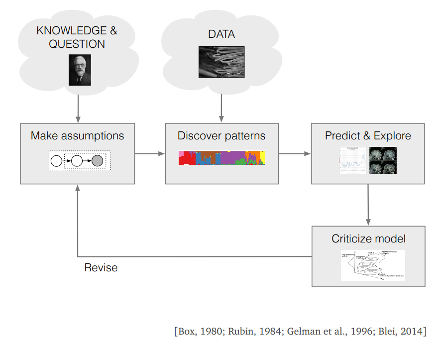
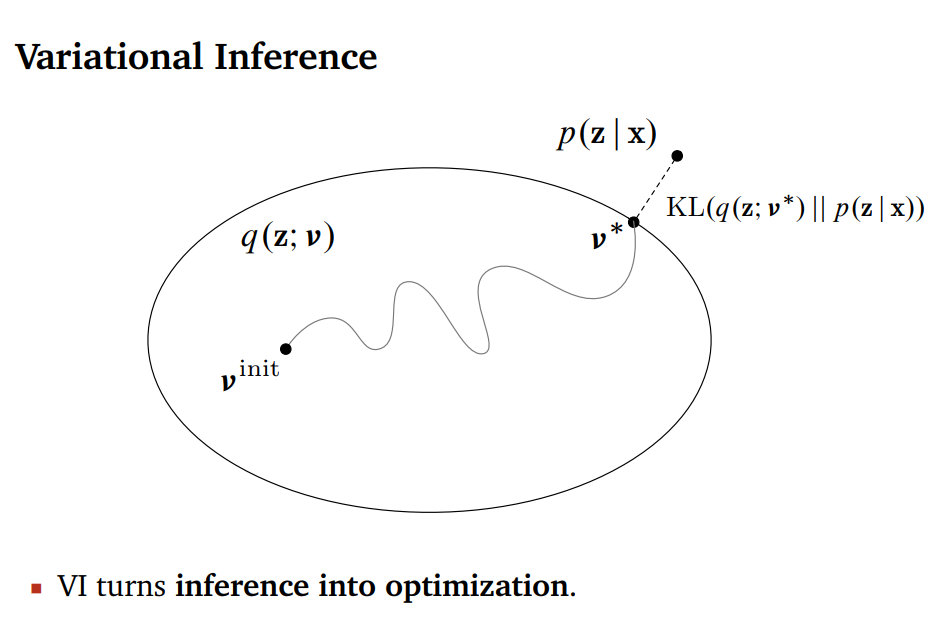
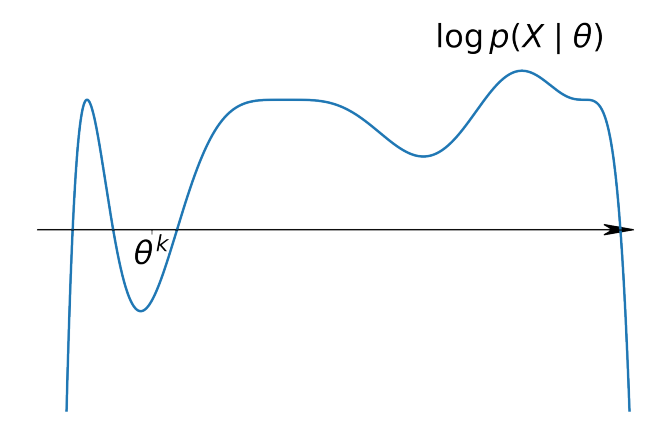
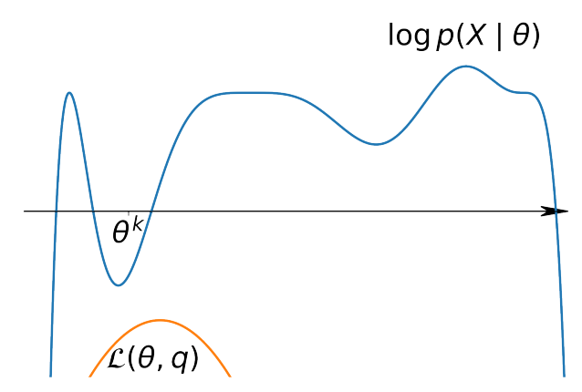
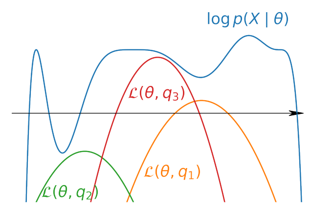
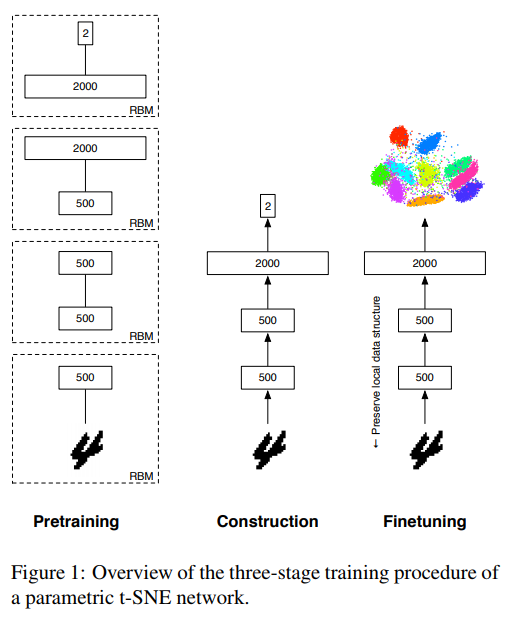
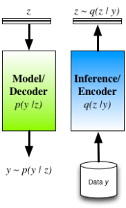

class: middle, center, title-slide
count: false

# Some ideas on Probabilistic approaches
for Dimensionality Reduction methods  
(potentially with user constraints)

  

Minh, 11/07/2018
---

class: middle

# Discrete Ideas

- Motivation:
    + Probabilistic ML can be a good direction [1,2].
    + Separation of `Models` and `Inference`.
    + More nature way to inject user constraints.

<!-- - Ideas:
    + based on t-SNE for InfoViz.
    + find the probabilistic approach for DR.
    + think about the way to inject (user) constraints into a probabilistic framework. -->

.footnote[Ghahramani, Zoubin. "Probabilistic machine learning and artificial intelligence." Nature 521.7553 (2015): 452.  
Bishop, Christopher M. "Model-based machine learning." Phil. Trans. R. Soc. A 371.1984 (2012).]

---

.width-100[]

---

# 1. Combining t-SNE and Gaussian Mixture Models

- Motivation
    + GMM works well in low dimensional space.
    + Can inject user constraints on:
        * the number of clusters
        * the position of some clusters

---

# 1. t-SNE + GMM (2)

- How?
    + Calculate $P$ and $Q$ as in t-SNE
    + Modify $Q$ to both minimize `KL-loss` (of t-SNE) and maximize `loglikelihood` (of GMM) at the same time.

- User Constraints:
    + Fixed: number of clusters, position of centroids of some clusters, pairwise constraints.
    + Interactive: merge or divise cluster.

---

# 2. Idea of Variational Inference for t-SNE

.width-80[]

.footnote[http://www.cs.columbia.edu/~blei/talks/2016_NIPS_VI_tutorial.pdf]
---

.width-40[]
.width-40[]
.width-40[]
---

# 3. Modify Parametric t-SNE

|||
|--|--|
|+ RBM is undirected graphical model, can used for DR   + Idea: Add constraint to pre-training step.|.width-80[]|

.footnote[Maaten, Laurens. "Learning a parametric embedding by preserving local structure." Artificial Intelligence and Statistics. 2009.]
---

# 4. Emsemble t-SNE
+ Construction of many t-SNE model (with different params)
+ Not use all feature of input data (-> have many combination of input features)
+ Take into account other params of t-SNE (e.g. degree of freedom for t-distribution)
+ If we can simulate the case we have `infinite` models, can we use Bayesian Optimization to select the good one?

---

# 5. AutoEncoder with a Probabilistic Decoder

Model is described by the `Encoder`, Inference occurs in the `Decoder` -> Can put constraints on both parts.
.right[]

.footnote[http://blog.shakirm.com/2015/03/a-statistical-view-of-deep-learning-ii-auto-encoders-and-free-energy/]
---

class: middle

# Research Questions

---

# RQ1

How to define a uniform probabilistic model
for both DR and clustering?
- Goal:
    + obtain a visualization with clear structures (as clusters)
    + a 'gateway' to use the constraints that work on clustering methods.

---

# RQ2

How to present (many types of) user constraints
under the probabilistic framework?

---

# User knowledges

+ Prior knowledges:
    * specifying conditional independencies among variables
    * specifying Bayesian network structure
    * determining values of some params
    * defining the prior distribution over params.

.footnote[Niculescu, Radu Stefan, Tom M. Mitchell, and R. Bharat Rao. "Bayesian network learning with parameter constraints." Journal of Machine Learning Research 7.Jul (2006): 1357-1383.]