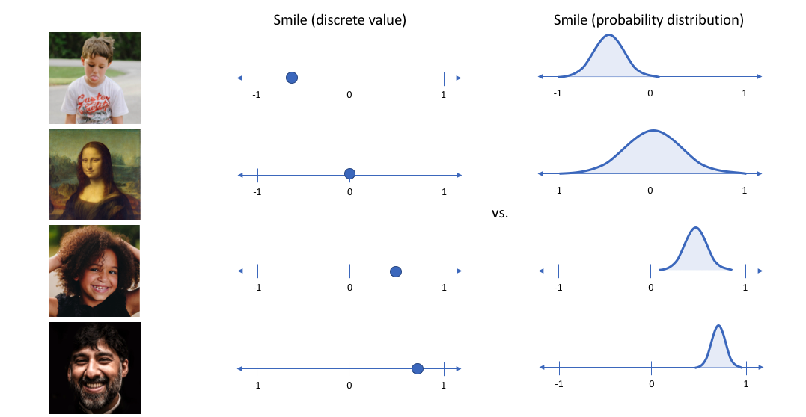

class: middle, center, title-slide
count: false

# Some ideas on Probabilistic approaches
for Dimensionality Reduction methods  
(potentially with user constraints)

  

Minh, 11/07/2018
---

class: middle

# Discrete Ideas

- Motivation:
    + Probabilistic ML can be a good direction [1,2].
    + Separation of `Models` and `Inference`.
    + More nature way to inject user constraints.

<!-- - Ideas:
    + based on t-SNE for InfoViz.
    + find the probabilistic approach for DR.
    + think about the way to inject (user) constraints into a probabilistic framework. -->

.footnote[Ghahramani, Zoubin. "Probabilistic machine learning and artificial intelligence." Nature 521.7553 (2015): 452.  
Bishop, Christopher M. "Model-based machine learning." Phil. Trans. R. Soc. A 371.1984 (2012).]

---

.width-100[]

---

# 1. Combining t-SNE and Gaussian Mixture Models

- Motivation
    + GMM works well in low dimensional space.
    + Can inject user constraints on:
        * the number of clusters
        * the position of some clusters

---

# t-SNE + GMM

- How?
    + Calculate $P$ and $Q$ as in t-SNE
    + Modify $Q$ to both minimize `KL-loss` (of t-SNE) and maximize `loglikelihood` (of GMM) at the same time.

- User Constraints:
    + Fixed: number of clusters, position of centroids of some clusters, pairwise constraints.
    + Interactive: merge or divide cluster.

---

# 2. Idea of Variational Inference

+ Many ML problems are to evaluate the posterior $p(z|x)$
+ Inference: transforming prior $p(z)$ to posterior $p(z|x)$ by observing the data.
+ Posit a **variational family** of distribution over latent variable $q(z; \nu)$
+ Fit $\nu$ to make $q$ close to $p$ in term of $KL[q||p]$

.right[.width-60[]]

.footnote[http://www.cs.columbia.edu/~blei/talks/2016_NIPS_VI_tutorial.pdf]
---

# EM as VI problem

+ Goal: Maximum likelihood $p(X|\theta)$: find $\theta$ that maximizes $p(X|\theta)$.
+ VI framework:
    * avoid evaluating $p(X|\theta)$ directly
    * find a simple distribution q to form a **lower bound** $\mathcal{L}(\theta, q)$
    * measure the gap between the approximated distribution $q$ and the target distribution $p$ by $KL[q||p]$
    * apply EM mechanism to find $q$ and $\theta$ that maximize $\mathcal{L}(\theta, q)$

.width-30[]
.width-30[]
.width-30[]

---

# Idea: VI for t-SNE with constraints
+ $p, q$: probability distribution in HD and LD
+ $p$ is fixed, $q$ is variated and controlled by the constraints $\theta$
+ Measure the different between $p$ and $q$ by $KL[q||p]$
+ Among all variational distribution of $\mathcal{L}(\theta, q)$, find one that minimize $KL$.

.width-30[]
.width-30[]
.width-30[]
---

# 3. AutoEncoder under probabilistic framework

Model is described by the `Encoder`, Inference occurs in the `Decoder` -> Can put constraints on both parts.
.right[]

.footnote[http://blog.shakirm.com/2015/03/a-statistical-view-of-deep-learning-ii-auto-encoders-and-free-energy/ 
Kingma, Diederik P., and Max Welling. "Auto-encoding variational bayes." arXiv preprint arXiv:1312.6114 (2013).]

---

# VAE

+ Standard AE: output real value for each `latent feature`
+ Variational AE: output probabilistic distribution for latent variables.

.width-40[]
.width-50[]

.footnote[https://www.jeremyjordan.me/variational-autoencoders/]

---

# 4. Modify Parametric t-SNE

|||
|--|--|
|+ RBM is undirected graphical model, can used for dimensionality reduction   + Idea: Add constraint to pre-training step.|.width-80[]|

.footnote[Maaten, Laurens. "Learning a parametric embedding by preserving local structure." Artificial Intelligence and Statistics. 2009.]

---

# 5. Ensemble t-SNE

+ Use parametric t-SNE to obtain an explicit mapping.
+ Randomly take some input features (not all) to build many t-SNE models.
+ Using the idea of average weighting in [1] to construct the final models.

.footnote[[1]Izmailov, Pavel, et al. "Averaging Weights Leads to Wider Optima and Better Generalization." arXiv preprint arXiv:1803.05407 (2018).]

+ Or: construct many t-SNE models (with different params), and use **Bayesian Optimization** to do hyperparameter tuning to select the best one (?)

---

class: middle

# Research Questions

---

# RQ1

- How to define a uniform probabilistic model that can describe (at the same time):
    + the data distribution in high dimensional space
    + a cluster structure in low dimensional space
    + user constraints

- Goal:
    + obtain a visualization with clear structures (as clusters)
    + a _gateway_ to use the constraints that work on clustering methods.

---

# RQ2

How to present (many types of) user constraints
under the probabilistic framework?

+ Prior knowledges:
    * specifying conditional independences among variables
    * specifying Bayesian network structure
    * determining values of some params
    * defining the prior distribution over params.

.footnote[Niculescu, Radu Stefan, Tom M. Mitchell, and R. Bharat Rao. "Bayesian network learning with parameter constraints." Journal of Machine Learning Research 7.Jul (2006): 1357-1383.]